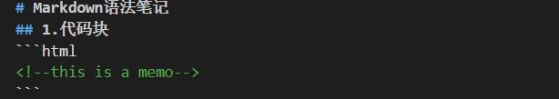
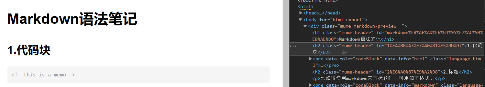

# <center>Markdown语法笔记
## Markdown是什么、优势、工作流
- ### Markdown是什么
    Markdown是一种[标记语言](https://baike.baidu.com/item/%E6%A0%87%E8%AE%B0%E8%AF%AD%E8%A8%80/5964436?fr=aladdin)，即含文本信息又含格式信息的语言，格式信息用标记进行标识。
    > \[例]
        传统语言：你好吗？（只含文本信息，表达 \[你好吗？]）
        标记语言：\*你好吗？\* （含文本信息，表达 \[你好吗？]； 含格式信息，字体是斜体，通过\*  \*标记来表达。

- ### Markdown的优势
    - 对word的优势
        在传统的word文档编辑中，通常是先编辑文本内容，然后在通过鼠标操作来实现不同的格式。Markdown则可在编辑文本内容的同时编辑格式内容，标记简单，且对于编辑内嵌代码、数学公式之类的内容更为友好。
    - 对html的优势
        同为标记语言，相比于广为人知的html，Markdown是一种轻量型标记语言，顾名思义，标记语法比较简单，没有html中各种标签的干扰，更易于读写。
    - 其他优点
        markdown为纯文本文档，可兼容所有文本编辑器和字处理软件；可快速导出为html、PDF或md本身文档。

- ### Markdown的工作流
    md文档由编辑者本地编辑完成后，发布到网页中，自动转化为html文档。
    <div align="center">

    

    本地编辑md文档

    

    发布到网页后，可见自动转为html

    </div>


## Markdown标记语法
### 1. 标题
使用\#号标记，可标记1-6级标题
代码：
```
# 一级标题
## 二级标题
### 三级标题
```
显示效果：
> # 一级标题
> ## 二级标题
> ### 三级标题
同时还可用\====或\----来表示，个人认为没有\#好用，就舍了，详见[标题语法](https://www.runoob.com/markdown/md-title.html)。

另外，也可使标题居中，如下：
```
# <center>一级标题
```
显示效果：
> # <center>一级标题

详见：[markdown居中、靠左、靠右对齐](https://blog.csdn.net/u010422517/article/details/121946569)
此外，还可直接用html标签
\<div align="center">
\</div>
使其中间部分的所有内容全部居中，简单粗暴。

### 2. 列表
使用星号\*，减号\-，加号\+号标记，符号后面加一个空格再输入内容
代码：
```
* 标题1
* 标题2 
* 标题3

- 标题1
- 标题2
- 标题3
    
+ 标题1
+ 标题2
+ 标题3
```
显示效果都为：
> - 标题1
> - 标题2
> - 标题3
    
有序列表直接按照常规写数字和.即可；别忘了加空格
代码：
```
1. 第一项
2. 第二项
3. 第三项
```
显示效果：
> 1. 第一项
> 2. 第二项
> 3. 第三项

嵌套列表，如上语法，按照正常逻辑嵌套即可，主次级相差四个空格或一个TAB键
代码：
```
1. 第一项
    - 第一项内容1
```
显示效果：
> 1. 第一项
>    - 第一项内容1

### 3. 字体
markdown可使用 *斜体* ，**粗体**，***斜粗体***，这三种字体
代码：
```
*斜体*
**粗体**
***斜粗体***
```
显示效果如上

### 4. 段落
- 换行
在段落后加一个空行即可
代码：
    ```
    段落1

    段落2
    ```
    显示效果：
    > 段落1
    > 
    > 段落2

- 分隔线
下面每种写法都能建立分隔线
代码：
    ```
    ***
    * * * 
    ******
    - - -
    ------
    ```
    显示效果都为：
    > ------

- 下划线
下划线直接使用html的标签比较方便
代码：
    ```
    <u>下划线文本</u>
    ```
    显示效果：
    > <u>下划线文本</u>

- 脚注
对文本进行附加内容的脚注，会显示在<u>文档的末尾</u>
代码：
    ```
    合适的增加能够让我们更好的理解[^mark]
    [^mark]: 这是一个标注
    ```
    显示效果：
    > 合适的增加能够让我们更好的理解[^mark]
    > [^mark]: 这是一个脚注

### 5. 区块
在文档中插入一个区块，作突出显示相关内容用，>加空格
代码：
```
> 周杰伦 
> yyds?
> absolutely right
```
显示效果：
> 周杰伦
> yyds?
> absolutely right

区块结束后要空一行再输入新内容，如下：
```
> 周杰伦 
> yyds?
> absolutely right

林俊杰也不戳~
```
显示效果：
> 周杰伦
> yyds?
> absolutely right

林俊杰也不戳~

另外，区块也可以进行嵌套，如下：
```
> 区块1
>> 区块2
>>> 区块3
```
显示效果：
> 区块1
>> 区块2
>>> 区块3

### 6. 内嵌代码
在md文档中插入代码，可分两种情况
1. 在段落内部插入代码，如`print()`函数是这样的
代码：
    ```
    如`print()`函数是这样的
    ```
    显示效果如上
    当然，在段落外也可直接使用如
    ```
    `print()`
    ```
    显示效果：
    `print()`

2. 在段落外插入代码块，可用\```包裹，并指定一种语言，也可以不指定
代码：
```
    ```python
    print()
    ```
```
显示效果：
```python
print()
```
### 7. 超链接
使用方法如下：
```
[链接名称](链接地址) 如：[可爱的度娘](https://www.baidu.com)
或
<链接地址>
```    
显示效果：
> [可爱的度娘](https://www.baidu.com)
> <https://www.baidu.com/>

### 8. 图片
图片部分[md的语法](https://www.runoob.com/markdown/md-image.html)没比html方便多少，故直接用html的语法了
代码：
```
 图片和文档在同一文件夹
 图片在a文件夹，文档和a文件夹在同一目录 
 图片在a文件夹，文档在b文件夹，a b文件夹在同一目录
```
图片格式调整详见：<https://www.w3school.com.cn/tags/att_img_height-width.asp>

### 8. 表格
markdown使用 \| 来分隔单元格，制作表格，别说，还挺形象的
代码：
```
|表头|表头|
|----|----|
|单元格|单元格|
```
效果如下：
> |表头|表头|
> |----|----|
> |单元格|单元格|
使用 \: 与 \-（均为英文符号) 来设置左右、居中对齐，也是很形象
代码：
```
|左对齐|右对齐|居中对齐|
|:----|----:|:----:|
|单元格|单元格|单元格|
```
显示效果：
> |左对齐|右对齐|居中对齐|    
> |:----| ----: | :----: |
> |1|2|3|
> （这里标题也对齐了，显示不明显而已）

### 9. 特殊符号
由于markdown的语法定义，许多符号都由其具体的功能，单纯输入这些符号并不会单独显示出来，需加入反斜杠 \ 来表示
代码：
```
**不显示星号**

\*\*显示星号\*\*
```
显示效果：
> **不显示星号**
> 
> \*\*显示星号\*\*

支持符号：


### 10. 数学公式
markdown可用[Katex](https://github.com/KaTeX/KaTeX)或[MathJax](https://github.com/mathjax/MathJax)来渲染数学公式，这里采用katex，katex比mathJax更快，但mathJax支持的功能更多。
编辑器采用vs code,首先需要从vs code下载Katex插件
与代码块类似，标记符号为$
1.可用\$...\$来渲染段落内的公式
2.用\$\$...\$\$渲染出来的公式将在块内显示
3.公式注解可用 `\tag{注解内容}` 或 `\tag*{注解内容} `,一个公式块内只能有一个tag

代码：
```
我们有一个函数$f(x,y)=3x^2+4y^3$
```

```
$$
\tag*{formula 1} f(x,y)=3x^2+4y^3
$$
```

```
$$
\tag{formula 2} f(x,y)=4x^2+3y^2
$$
```
显示效果:
> 我们有一个函数$f(x,y)=3x^2+4y^3$

> $$
> \tag*{formula 1} f(x,y)=3x^2+4y^3
> $$

> $$
> \tag{formula 2} f(x,y)=4x^2+3y^2
> $$

更多Katex数学运算标记详见[Katex数学公式整理](https://blog.csdn.net/tonydz0523/article/details/88420049)，这部分无需记忆，即用即查即可。

## 软件选用
进行markdown文本的编辑写作，网上大部分都是推荐[Typora](https://typoraio.cn/)，这个软件本身很优秀，**所见即所得**的编辑方式是这个软件的核心卖点,这一点确实很新手向。这可能更适合那些**纯文字工作者**，或许对于这部分群体而言，编辑器长得越像记事本越成功，减少干扰，专注于内容本身才是第一位的。
但我觉得这一做法操作更偏向传统的word操作，已经有违背Markdown的设计初衷了。写md文本目的之一就是为了文本、格式键盘全搞定，不再用鼠标点来点去调格式，之二就是有点敲代码的感觉，让写作更上头，反而会更专注。
所以我更喜欢**VS Code+插件**的方式，一页源文档编辑，一页实时渲染，这才是Markdown最爽的打开方式:blush:


- [Markdown实用emoji](https://www.webfx.com/tools/emoji-cheat-sheet/)
- [Markdown实用插件](https://www.kancloud.cn/pwedu/code-fans/321504#1_Markdown__14)
- [使用Markdown preview enhanced转PDF时缺少princexml的解决办法](https://blog.csdn.net/max_xws/article/details/85319679)