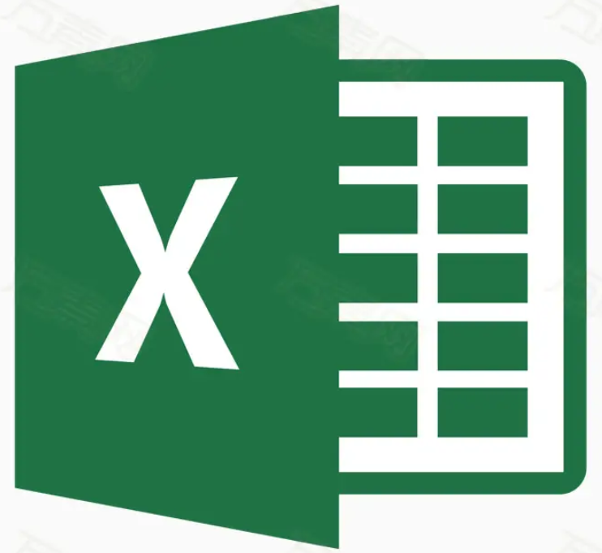

### 1.关于我

2018年本科毕业，从事汽车LED灯具模组的生产工作。

熟悉SMT技术，车用LED模组的标准及特性，以及生产流程。

对半导体器件、芯片以及单片机很有兴趣，目前在深入学习半导体器件，半导体工艺设计，计划未来可以从事芯片设计&生产相关工作。

### 2.核心技能

**计算机语言：**

||

PYTHON熟悉，HTML了解一点。
一直想学C、C++这类的编程语言，不过目前对于我用不上，也就一直在搁置。

 

**电子开发软件：**

||

熟练使用AD、Multisim。

 

**开发效率工具：**

|||||

熟练使用Github\VS Code\Sublime Text 3 。

了解MATLAB，只在上学的时候做过模拟。

 
 
 

**一些不是特别重要的技能：**

||||||

经典微软办公三件套+PS，PS平时没事修修图所用，慢慢的也就学会了...
VBA纯属兴趣所学，感觉自动化表格很酷。

曾经做过的一些东西：

>待补充。

### 4.其他补充

待续。

